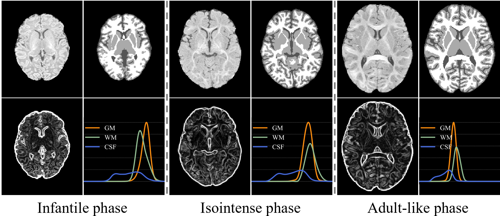
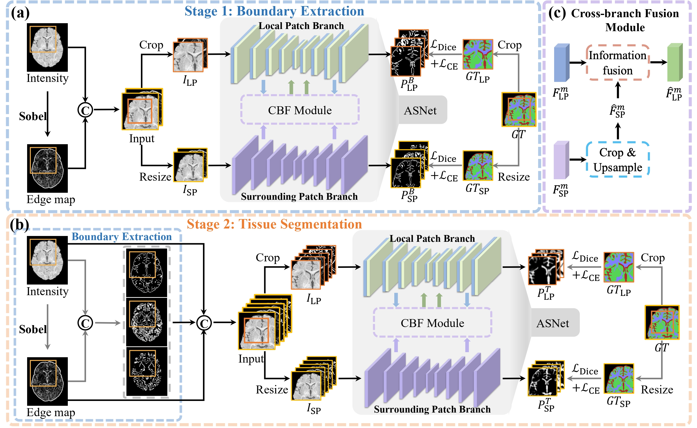

# Unified Infant Brain Tissue Segmentation


> "UinTSeg: Unified Infant Brain Tissue Segmentation with Anatomy Delineation", _MICCAI 2024_, [Jiameng Liu, Feihong Liu, Kaicong Sun, Yuhang Sun, Jiawei Huang, Caiwen Jiang, Islem Rekik, and <u>Dinggang Shen</u>]


## [<font color=#F8B48F size=3>License</font> ](./LICENSE)
```
Copyright IDEA Lab, School of Biomedical Engineering, ShanghaiTech University, Shanghai, China

Licensed under the the GPL (General Public License);
you may not use this file except in compliance with the License.
You may obtain a copy of the License at

    http://www.apache.org/licenses/LICENSE-2.0

Repo for Unified Infant Brain Tissue Segmentation
Contact: JiamengLiu.PRC@gmail.com
```

## Intensity distribution


## Framework



## Results
